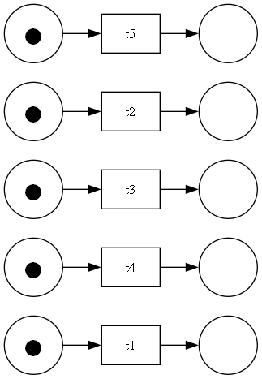

This directory contains some examples of created library

There is the same set of Petri nets for all cases: 

Each test contains 2 files: runnable code and possible set of logs that can be received during simulation

The following designations are used below:

1. a < b when a occurs before b
2. a !< b when a does not occur before b

First test represents deadlock situation with next conditions:

1. t1 !< t2
2. t1 !< t5

It is obvious that there are a lot of ways to get deadlock with such condition, for example trace t2, t5, t4, t3 will
give us a deadlock because in this case we can not take t1. Because of random choice of step, in this testcase was
created 5000 traces in order to increase possibility of getting deadlock

Second test represents situation where all transitions triggers in strict order: t1 -> t2 -> t3 -> t4 -> 5

Third test represents work of synchronized transitions with next conditions:
1. t1, t2 and t3 trigger synchronized
2. t4 and t5 trigger synchronized